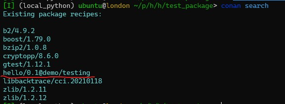
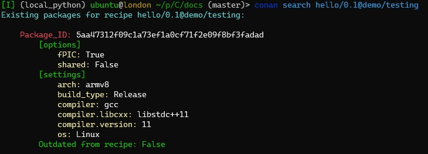
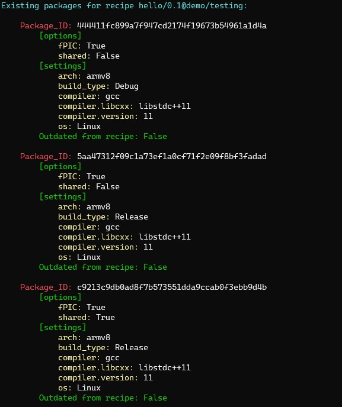
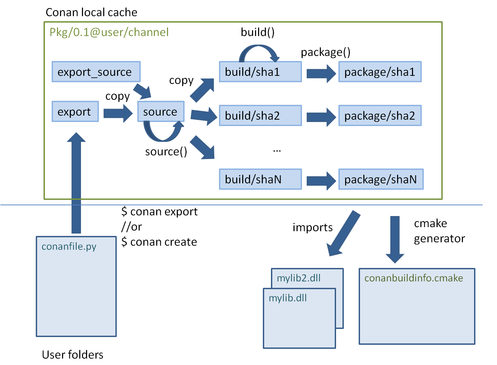

Creating packages with conan
============

[Main link to the creating packages documentation](https://docs.conan.io/en/latest/creating_packages.html)

[Mastering conan](https://docs.conan.io/en/latest/mastering.html)

[Create installer packages](https://docs.conan.io/en/latest/devtools/create_installer_packages.html#create-installer-packages)

[Running your server](https://docs.conan.io/en/latest/uploading_packages/running_your_server.html)

[Creating hello package](https://docs.conan.io/en/latest/creating_packages/getting_started.html)

Creating a new package:
~~~bash
conan new hello/0.1 --template=cmake_lib
~~~

Building the package:
~~~bash
conan create . demo/testing
~~~

How to list [local packages](https://docs.conan.io/en/latest/creating_packages/getting_started.html):
~~~bash
conan search
~~~

Looking for the detail information with the next command:
~~~bash
conan search hello/0.1@demo/testing
~~~

> The `conan create` command receives the same command line parameters as conan install so you can pass to it the same settings and options. If we execute the following lines, we will create new package binaries for those configurations:

Creating a debug package

~~~bash
conan create . demo/testing -s build_type=Debug
~~~
>...
>
>hello/0.1: Hello World Debug!

Creating a release *.so packages:
~~~bash
conan create . demo/testing -o hello:shared=True
~~~

>...
>
>hello/0.1: Hello World Release!

Cloning repositories
------------

Main link is [here](https://docs.conan.io/en/latest/creating_packages/external_repo.html).

In short:

1. By using `source()`

    ~~~python
    from conans import ConanFile, CMake, tools

    class HelloConan(ConanFile):
        ...

        def source(self):
            self.run("git clone https://github.com/conan-io/hello.git")
            ...
    ~~~

1. By using `source()` and [tools.Git](https://docs.conan.io/en/latest/reference/tools.html#tools-git)

    ~~~python
    from conans import ConanFile, CMake, tools

    class HelloConan(ConanFile):
        ...

        def source(self):
            git = tools.Git(folder="hello")
            git.clone("https://github.com/conan-io/hello.git", "master")
            ...
    ~~~

1. Using the [scm attribute](https://docs.conan.io/en/latest/reference/conanfile/attributes.html#scm-attribute)

    ~~~python
    from conans import ConanFile, CMake, tools

    class HelloConan(ConanFile):
        scm = {
            "type": "git",
            "subfolder": "hello",
            "url": "https://github.com/conan-io/hello.git",
            "revision": "master"
        }
        ...
    ~~~

Package Creation Process
------------

Original link is [here](https://docs.conan.io/en/latest/creating_packages/understand_packaging.html#package-creation-process).

The citation from the documentation:

> Each package recipe contains five important folders in the local cache:
> * `export`: The folder in which the package recipe is stored.
> * `export_source`: The folder in which code copied with the recipe exports_sources attribute is stored.
> * `source`: The folder in which the source code for building from sources is stored.
> * `build`: The folder in which the actual compilation of sources is done. There will typically be one subfolder for each different binary configuration
> * `package`: The folder in which the final package artifacts are stored. There will be one subfolder for each different binary configuration

ABI Compatibility
------------
The link is [here](https://docs.conan.io/en/latest/creating_packages/define_abi_compatibility.html)
### It was skpped for now

Using Components
------------
Components allow define a few binaries inside one package (as *.a, *.so or just binaries).
By default it is advisable to have only one binary per package.

The link on documentation is [here](https://docs.conan.io/en/latest/creating_packages/package_information.html#using-components)

