Deployment with conan
============

Cmake (version 3.15 or above) and python3 (3.6 or above) are required.

Install virtual package
------------
To install virtualenv in python3 you need to input the next command:
~~~bash
pip install virtualenv
~~~

Here is an example how it looks in my environment:
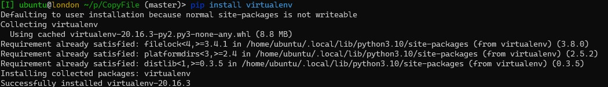

### If you have python2 as your default interpreter, you need to say explicitly to use python3.
~~~bash
pip3 install virtualenv
~~~

### If you do not have pip or pip3 you need to install it.
How to do this can be found [here](https://pip.pypa.io/en/stable/installation/).

Install virtual environment
------------
It is required to execute the next command to create a local python environment in the local directory:
~~~bash
virtualenv -p python local_python
~~~
or
~~~bash
virtualenv -p python3 local_python
~~~

You should see something like this:

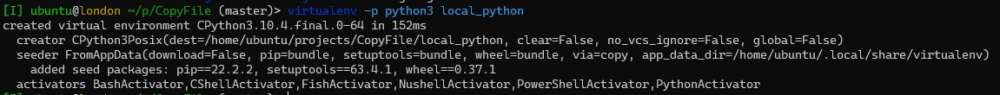

The next command should be (if you are using bash):
~~~bash
source local_python/bin/activate
~~~

*However, if you use a different shell you need to source a different profile.*

For example, the next exampel sources a profile for [fish](https://fishshell.com/).
~~~bash
source local_python/bin/activate.fish
~~~

Here is an example how I source the fish profile:

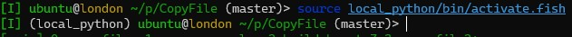

The list of other profile can be found in *local_python/bin*:

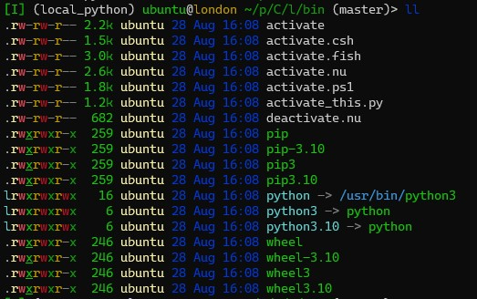

More information about virtual environments can be found [here](https://pythonbasics.org/virtualenv/).

Install Conan
------------

The next page about the [installation](https://docs.conan.io/en/latest/installation.html) process can be usefull.

However, basically, you need to run the next command:

~~~bash
pip install conan
~~~

Here how it looks in my environment:

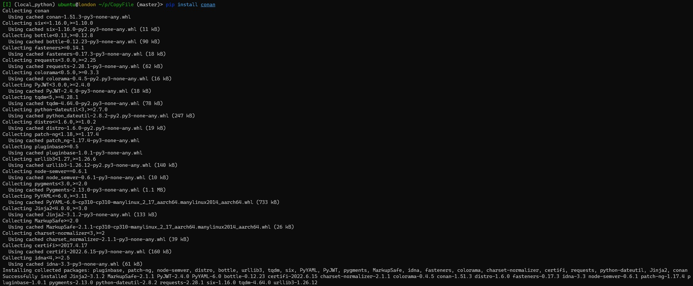

At the moment of the writing, conan2 is in beta and you can install it with the next command:
~~~bash
pip install conan --pre
~~~

Integration of Conan with Cmake
------------

This [link](https://docs.conan.io/en/2.0/tutorial/consuming_packages/build_simple_cmake_project.html) was originally used to research the topic. However, it is worth to mention that it was written for conan2 which is in beta at the moment of writing.

Here we will use recipes which are present in the cloud (center.conan.io).
You can check current remotes with the next command:
~~~bash
conan remote list
~~~

For my environment it looks the next way:

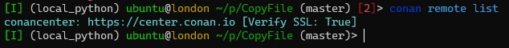

This repository has a conan config file which is called *conanfile.txt*.
The content of the file is
~~~properties
[requires]
boost/1.79.0
gtest/1.12.1
cryptopp/8.6.0

[generators]
CMakeDeps
CMakeToolchain
~~~

This file has two sections:
* *\[requires\]* section is where we declare the libraries we want to use in the project, in this case, *boost/1.79.0*, *gtest/1.12.1* and *cryptopp/8.6.0*;
* *\[generators\]* section tells Conan to generate the files that the compilers or build systems will use to find the dependencies and build the project. In this case, as our project is based in CMake, we will use CMakeDeps to generate information about where the libraries files are installed and CMakeToolchain to pass build information to CMake using a CMake toolchain file.

The next thing which we need to do is to generate a default profile.

[Here](https://docs.conan.io/en/2.0/tutorial/consuming_packages/build_simple_cmake_project.html) is a citation about this for conan2:
> Besides the conanfile.txt, we need a Conan profile to build our project. Conan profiles allow users to define a configuration set for things like the compiler, build configuration, architecture, shared or static libraries, etc. Conan, by default, will not try to detect a profile automatically, so we need to create one. To let Conan try to guess the profile, based on the current operating system and installed tools...

The documentation above shows the behaviour for the conan2 which is slightly different from the behaviour of the first version. The first version generates the profile automatically when `conan install` is run. It is not a desirable behaviour because by default it generates a profile with an old abi.

Here is an example how it looks:

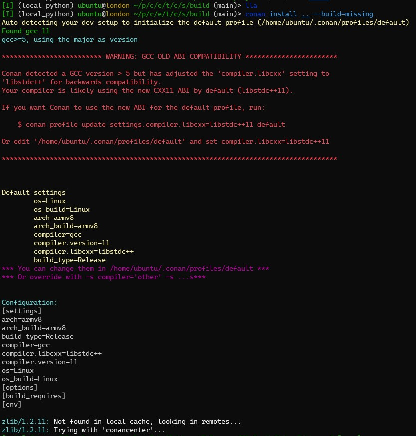

To avoid this we can forcibly create a default profile and modify it (e.g. like [here](https://github.com/conan-io/conan/issues/5129)).
To do this, run the next command:

~~~bash
conan profile new --detect default
~~~

You probably will have the next output:

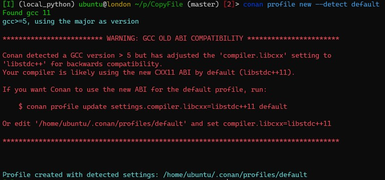

Now we can fix the abi by using the command which we were advised to use:

~~~bash
conan profile update settings.compiler.libcxx=libstdc++11 default
~~~

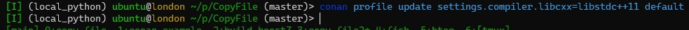

Now we can check the content of the profile, and make sure that it was modified.
You can execute the next command to do this:
~~~bash
vi  ~/.conan/profiles/default
~~~

Here is the content of the file:
~~~properties
[settings]
os=Linux
os_build=Linux
arch=armv8
arch_build=armv8
compiler=gcc
compiler.version=11
compiler.libcxx=libstdc++11
build_type=Release
[options]
[build_requires]
[env]
~~~
You probably will have a different configuration. Also, you will probably will be required to change more settings (e.g. `compiler.version`)

### `WARN` Using the default profile is not advisable
E.g. here is an example of output which I have for another project:

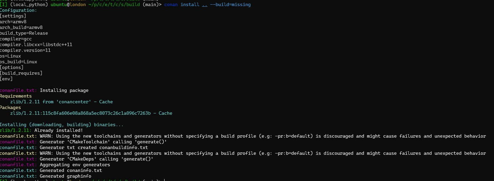

You can see these two lines:

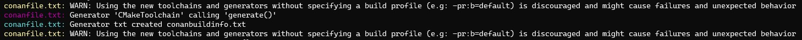

To fix this we can go to the profiles directory and copy the profile with a different name:
~~~bash
cd ~/.conan/profiles/
cp default copy_file_profile
~~~

Here is my example:

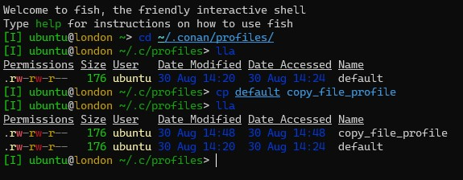
* `lla` is an alias of `exa -la -s=oldest --header --git --accessed --modified`. I am using [exa](https://the.exa.website/) instead of `ls`. With `ls` it should be something like `ls -Alt`.

Now we can check the list of profiles with the next command:
~~~bash
conan profile list
~~~

My output:

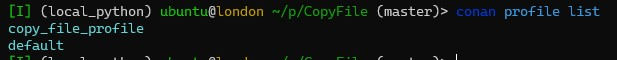

### `WARN` About `-pr:b` and `-pr:h` parameters

In the section above was mentioned that it is better to use `-pr:b` parameter to specify a profile.

[Here](https://docs.conan.io/en/latest/reference/profiles.html#build-profiles-and-host-profiles) is the documentation about this. And a citation:
> All the commands that take a profile as an argument, from Conan v1.24 are starting to accept two profiles with command line arguments -pr:h/--profile:host and -pr:b/--profile:build. If both profiles are provided, Conan will build a graph with some packages associated with the host platform and some build requirements associated to the build platform. There are two scenarios where this feature is extremly useful:
> * [Creating conan packages to install dev tools](https://docs.conan.io/en/latest/devtools/create_installer_packages.html#create-installer-packages)
> * [Cross building](https://docs.conan.io/en/latest/systems_cross_building/cross_building.html#cross-building)

So, it is not very useful in our case, and can cause problems. For example, I had a default profile with the old abi, and my profile with the new one and because I specified only a build profile (`-pr:b=copy_file_profile`) it used a default profile as host profile which caused issues because I compiled against a wrong abi.

It is better to specify `-pr` or `--profile`.

Building with Conan and Cmake
------------

Finally, we can build our project:

1. Let's create a directory where we will build:
    ~~~bash
    mkdir build
    ~~~
1. Go to the directory:
    ~~~bash
    cd build
    ~~~
1. Generate Conan files:
    ~~~bash
    conan install .. --build=missing --profile copy_file_profile
    ~~~
    where
    * `..` - the place where `conanfile.txt` is located
    * `--build=missing` - specifies that we need to build missing dependencies
    * `--profile copy_file_profile` - specifies our profile
1. Generate Cmake files:
    ~~~bash
    cmake .. -DCMAKE_TOOLCHAIN_FILE=conan_toolchain.cmake -DCMAKE_BUILD_TYPE=Release
    ~~~
    where
    * `..` - the place where _CMakeLists.txt_ is placed
    * `-DCMAKE_TOOLCHAIN_FILE=conan_toolchain.cmake` - specifies _conan_toolchain.cmake_ which has information where to find our dependencies which we installed
    * `-DCMAKE_BUILD_TYPE=Release` - the type of the build
1. Build:
    ~~~bash
    make
    ~~~